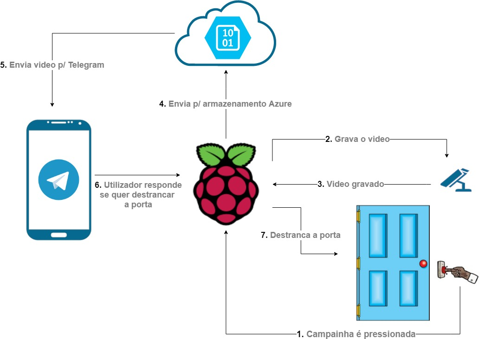
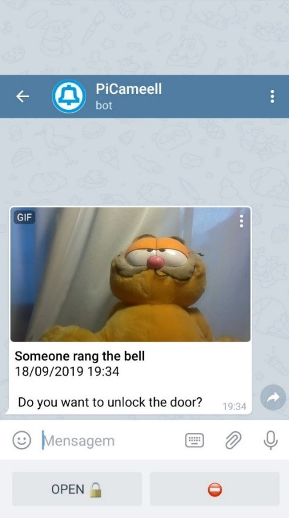

# Cloud Keeper

O Cloud Keeper é um modelo conceptual de uma campainha inteligente usando tecnologias IOT e Cloud, desenvolvido no âmbito do meu projeto final de licenciatura.

Este projeto utiliza o Microsoft Azure, o Telegram e um Raspberry Pi como componentes principais.




Com base na arquitetura apresentada, o fluxo do projeto é de simples compreensão:
1) Quando um utilizador pressiona a campainha, é transmitida a instrução para o Raspberry Pi
gravar um vídeo com duração de 10 segundos através do módulo de câmara, de modo a saber 
quem pressionou a campainha. 
2) Depois de gravar o vídeo, o Raspberry Pi envia-o para a conta de armazenamento do Azure (através de shared access signatures). De seguida é obtida outra shared access signature para partilhar o vídeo diretamente da conta de armazenamento do Azure, através de um URL.
3) O URL é enviado para a conversa do Telegram através de um bot, e é apresentado ao utilizador 
o vídeo de quem pressionou a campainha, juntamente com a hora a que foi pressionada e opções 
para destrancar a porta ou ignorar. 

4) Após o utilizador responder com uma das opções, a resposta é registada e interpretada pelo bot. Se 
a resposta for a instrução para destrancar a porta, é transmitida para o Raspberry Pi e 
sequencialmente para o servomotor, que irá destrancar a porta.

## Usage

```python
python main.py & >/dev/null
python telegramListener.py
```
